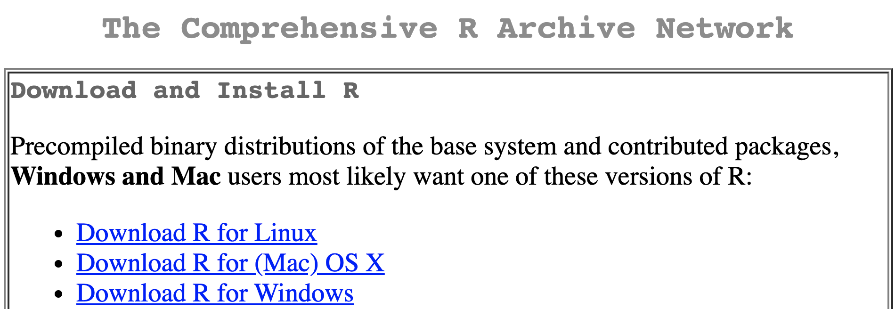

```{r xaringan-themer, include = FALSE}
options(blogdown.knit.serve_site = FALSE)
library(xaringanthemer)
mono_light(
  base_color = "midnightblue",
  header_font_google = google_font("Josefin Sans"),
  text_font_google   = google_font("Montserrat", "500", "500i"),
  code_font_google   = google_font("Droid Mono"),
  link_color = "#8B1A1A", #firebrick4, "deepskyblue1"
  text_font_size = "28px",
  code_font_size = "26px"
)
```

# Welcome

- Welcome to the BIOS524 course, "Biostatistical Computing"

- The course contains two parts

- We start with the R programming language and continue with learning SAS

.pull-left[
.center[]
]
.pull-right[
.center[]
]

---
# Why programming

- Programming will make your academic journey better

- Instead of remembering what buttons you clicked, what analyses you did, you write scripts with exact commands implementing your analysis

- Your scripts allow others to understand/reproduce it (or, spot mistakes)

- Programming forces you to have a deeper understanding of what you are doing, and facilitates your learning and comprehension of the methods you use

???

Welcome to the BIOS524 course, "Biostatistical Computing". It contains two parts. We start with the R programming language and continue with learning SAS. Mastering programming will significantly improve your academic journey - you will be making less mistakes, remember all you did because it will be in code, and have a deeper understanding of biostatistical methods

---
## Why R?

- R is a programming language designed for data analysis and statistics
  - Started by Robert Gentleman and Ross Ihaka (hence `R`) in 1995 as a free, independent, open-source implementation of the `S` programming language
  - Currently, maintained by the R Core development team
  
- Extremely powerful for statistical modeling, machine learning, data manipulation, and visualization
    - Efficient data analysis on data of all shapes and sizes
    - Optimized operations on vectors, matrices, lists
    - Very sophisticated graphs and data visualizations

- Not just scripts, but reproducible reports, papers, presentations, web apps

<!-- - Free, cross-platform, and open-source. -->

.small[ https://www.r-project.org/ ]

???

R is a powerful programming language for statistical modeling, machine and deep learning, data manipulation, and visualization. It works with many data types, including big data, optimized for vector and matrix operations, and exels at data visualization and generating publication-quality figures. R is more than a programming language and allow to generate reproducible reports, papers, presentations, and web applications. R is free, cross-platform, and open-source

---
## Why R?

- Thousands of packages that add extra functionality. Covering virtually all scientific disciplines and analytical frameworks
    - Image analysis, geospatial, epidemiology, genetics, bioinformatics, and a lot more

Over [20,808](https://cran.r-project.org/web/packages/index.html) CRAN (The Comprehensive R Archive Network) packages and [2,300](https://bioconductor.org/) Bioconductor packages, as of May 2024

<!-- .small[ [18,000 CRAN packages, tweet by Dirk Eddelbuettel, 2021-08-11](https://twitter.com/eddelbuettel/status/1425425651092410369?s=20) ] -->

- R can connect to spreadsheets, databases, and many other data formats, on your computer or on the web

- Large and welcoming user community

???

R has thousands of packages that extend its functionality. These packages cover virtually any scientific discipline and analysical framework, ranging from image analysis, geospatial statistics, to genomics, bioinformatics, and a lot more. R works with Excel spreadsheets, and can use practically any database and data format, on your computer and in the cloud

---
## Install/update R

- Installation for Windows, Mac, and Linux is available on CRAN (Comprehensive R Archive Network)

- New version of R is released every 6 month, typically around April/October

- Use `installr` R package to cleanly update R on Windows

.center[]

.small[ https://cran.r-project.org/, https://CRAN.R-project.org/package=installr ] 

???

To install R, visit the CRAN website and download the appropriate installer for your operating system, Windows, macOS, or Linux. Execute the installer and follow the on-screen instructions to complete the installation

