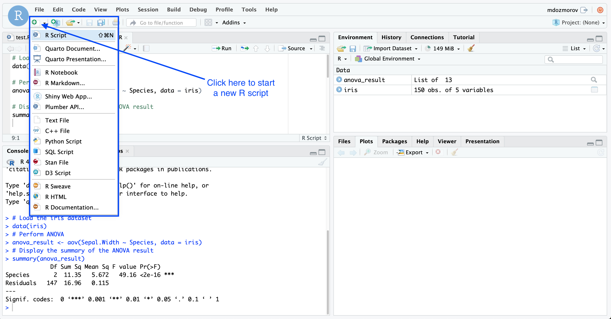
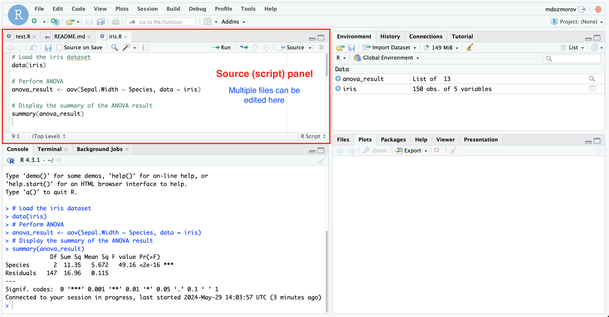
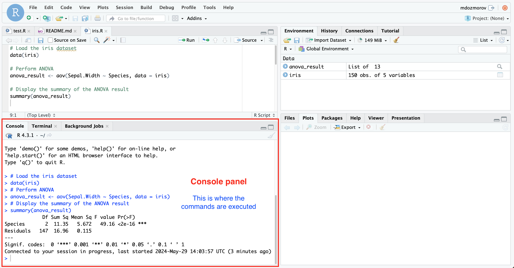
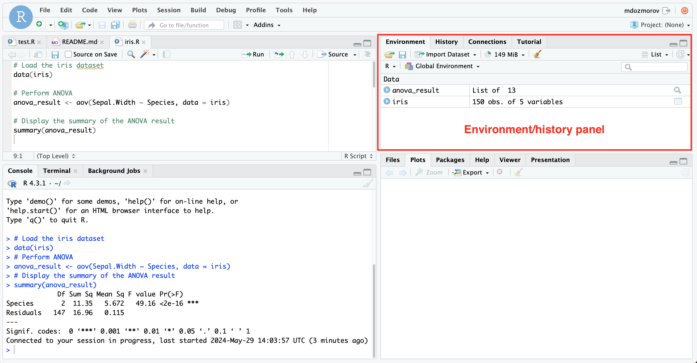
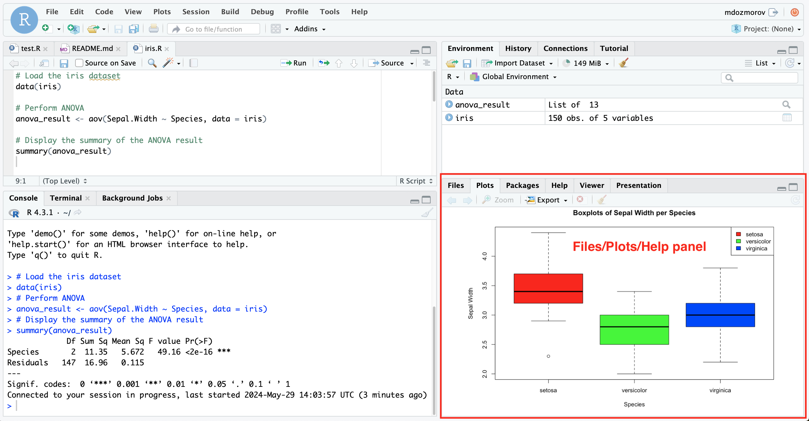
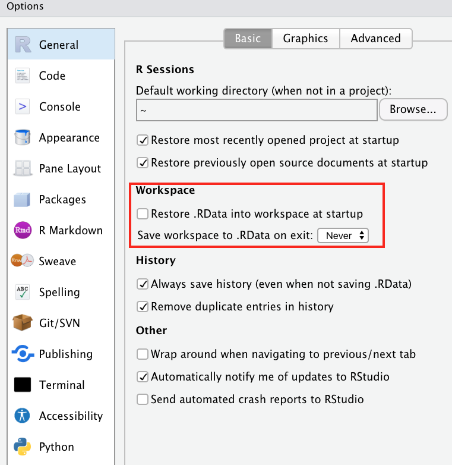
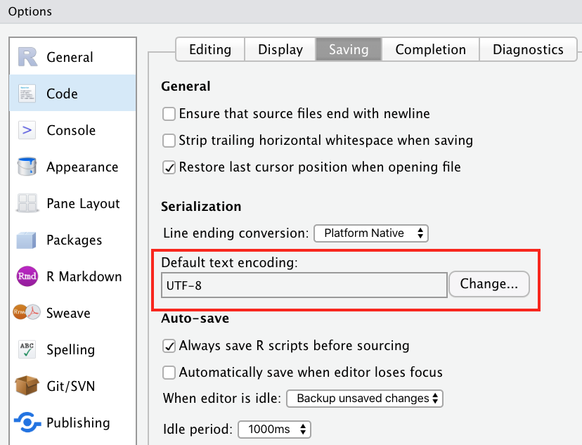
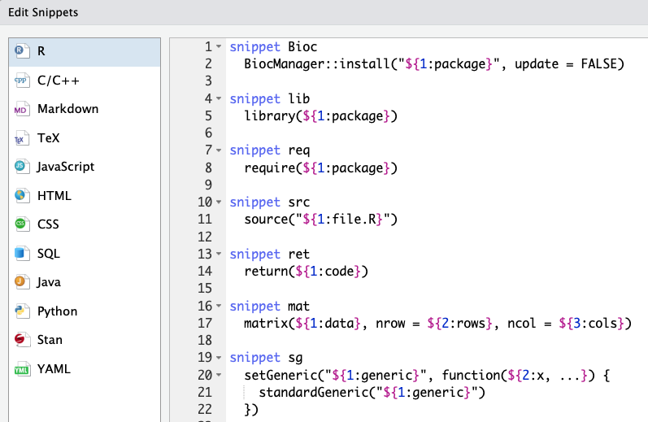
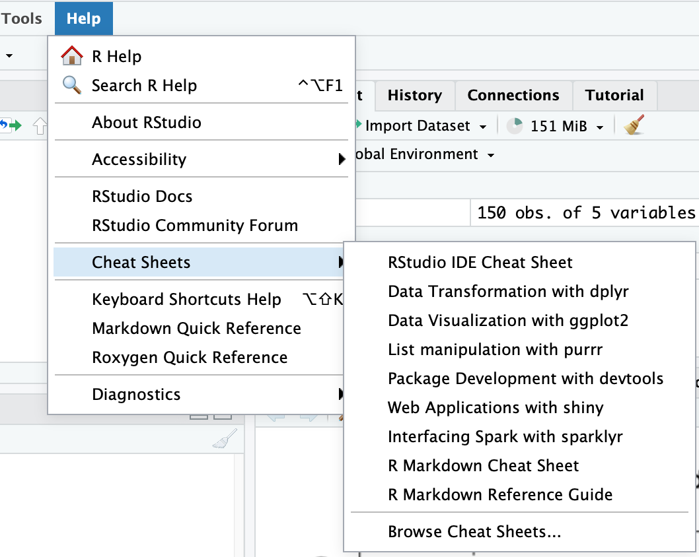

```{r xaringan-themer, include = FALSE}
options(blogdown.knit.serve_site = FALSE)
library(xaringanthemer)
mono_light(
  base_color = "midnightblue",
  header_font_google = google_font("Josefin Sans"),
  text_font_google   = google_font("Montserrat", "500", "500i"),
  code_font_google   = google_font("Droid Mono"),
  link_color = "#8B1A1A", #firebrick4, "deepskyblue1"
  text_font_size = "28px",
  code_font_size = "26px"
)
```

## RStudio

- RStudio is an IDE (integrated development environment) to work with R, with many features and functionalities for efficient work

- Integrates file navigation, visualization, documentation, version control and project management

- You write the same R code in RStudio as you would elsewhere, and it executes the same way. RStudio helps by keeping things nicely organized

- Developed by Posit (formerly, Rstudio) company, https://posit.co/

- Free, cross-platform, and open-source

https://posit.co/download/rstudio-desktop

???

Using R was revolutionized with the development of RStudio. It is an integrated development environment for coding, file navigation, visualization, documentation, version control and project management. It is being developed by Posit company (formerly, Rstudio) and, as R itself, remains free, cross-platform, and open-source.

---
## Why RStudio

- Project-centric work - scripts and data are organized in one folder (project), easily accessible

- Work on multiple projects simultaneously in several instances of RStudio

- Work on multiple (types of) scripts

- **After you install R and RStudio, you only need to run RStudio.**

???

RStudio organizes your work around a project, which is a folder on your computer containing scripts and data. It allows seamless switching between projects and restoring open files, or working with multiple projects in several instances of RStudio. It supports various file types, including different programming lanfuages. RStudio is an interface to R, and after you install R and RStudio, you only need to run RStudio. 

---
## RStudio interface

- Single workspace with four (rearrangeable, zoomable) panels.

- See all variables in R environment, easily visualize them.

- Easy access to help, plots, packages.

- Simple integration with Git version control system.

???

RStudio interface contains four panels presenting different information. You can change their appearance, rearrange, and zoom them. These panels allow to easily see and visualize all variables in R environment, access help, plots, packages, and use Git version control system.

---
## Four panels of RStudio

.center[]

???

Here is how the RStudio four-panel interface looks like. The top-left corner has a button to start a new R script or other files. 

---
## Source (script) panel

.center[]

???

The Source (Script) Panel is located in the top-left corner by default. It is used for writing and editing R scripts, Markdown documents, Shiny applications, and more. RStudio supports features syntax highlighting, code completion, and the ability to run code directly from the script. It supports multiple tabs for working on different files simultaneously, and these tabs can be rearranged. 

---
## Console panel

.center[]

???

The Console Panel is positioned in the bottom-left corner. It is the place where you can type and execute R commands interactively. It displays the output of commands and results of code execution. It provides an immediate feedback loop for testing and debugging code.

---
## Environment/history panel

.center[]

???

The Environment/History Panel is located in the top-right corner. The Environment Tab shows all the objects (like data frames, vectors, functions) currently in the R environment. You can inspect and visualize the content of these objects. The History Tab records all the commands that have been run in the console. You can review, search, and re-execute past commands from here.

---
## Files/Plots/Packages/Help/Viewer Panel

.center[]

???

The Files panel is located in the bottom-right corner. It has multiple tabs. The Files Tab allows you to navigate the file system and manage project files. The Plots Tab displays visualizations and graphics generated by your R code. The Packages Tab manages installed R packages. You can load, unload, and install packages from here. The Help Tab provides access to R's documentation and help files. The Viewer Tab renders web content, including R Markdown documents and Shiny applications, directly within RStudio.

---
## RStudio interface features

<!-- RStudio is divided into 4 panes, by default: -->

<!-- - **Source** for scripts and documents (top-left). -->
<!-- - **Environment/History** (top-right). -->
<!-- - **Files/Plots/Packages/Help/Viewer** (bottom-right). -->
<!-- - **R Console** (bottom-left). -->

- Autocompletion
  - Start typing a function or variable, and a dropdown menu appears with suggestions. Use the Tab key to complete the suggestion.

- Code highlightning
  - Automatically applied when you write code, making it easier to read and debug.

- Color themes
  - Go to Tools > Global Options > Appearance to select a different theme (e.g., Editor theme Vibrant Ink).

- Keyboard shortcuts
  - Most frequently used shortcuts include `Command (Ctrl) + Enter` - Run current line/selection, go to the next line, `Alt + Enter` - Run current line/selection, stay on the current line, `Ctrl + 1/2` - Switch between source and console panels, `Ctrl + L` - Clear console, `Ctrl + Alt + I` - Create new code chunk, `Ctrl + Alt + c` - Run current code chunk, and all the usual - Ctrl + Z, C, X, V, S, O. You can view all shortcuts under Help > Keyboard Shortcuts Help.

- RStudio AI Copilot
  - Integrates AI-based suggestions and completions directly into the RStudio IDE. It helps users by offering code completions, recommendations, and even generating entire code snippets based on the context of the code being written.

???

RStudio has several features making your work more convenient. As you type, RStudio suggests functions, variable names, and arguments, helping you write code faster and with fewer errors. RStudio also highlights different elements of code, such as keywords, variables, strings, and comments, in different colors. Additionally, it highlights matching parentheses which helps to orient in complicated code parts. RStudio allows users to change the color scheme of the editor, which can reduce eye strain and improve readability. RStudio also provides numerous keyboard shortcuts to run code, navigate between tabs, and manage files. The standard Copy/Paste and Undo combinations also work.

---
## RStudio settings

- Set to "Never" the 'Save workspace to .RData on exit' option and uncheck the 'Restore .RData into workspace at startup' option in "Tools/Global Options/General".

.center[]

???

In RStudio, we recommend to set "Never" for the 'Save workspace to .RData on exit' option and to uncheck the 'Restore .RData into workspace at startup' option in the "Tools/Global Options/General" settings. These settings prevent RStudio from automatically saving the workspace to a .RData file when you exit the session, avoiding the accumulation of unnecessary data objects. This way, you have better control over what gets saved and ensure that your workspace starts clean each time. Starting with a clean workspace ensures that your scripts are self-contained and reproducible, as they will not rely on objects that were created in a previous session.

---
## RStudio settings

- In the "Saving" tab, set 'UTF-8' as default text encoding, to avoid character encoding issue between Windows and other operating systems.

.center[]

???

Another recommended setting is the UTF-8 encoding. UTF-8 is a widely used character encoding standard that can represent a vast array of characters from different languages consistently over different operating systems. By setting 'UTF-8' as the default text encoding, you help ensure that your R scripts, data files, and documentation remain readable and correctly formatted across different environments and platforms, facilitating smoother collaboration and reducing the risk of encoding-related problems.


---
## RStudio settings

- In "Tools/Global Options/Code", check 'Enable code snippets', look what snippets are available and add your own. In the "Completion" tab, set completion delay to 0ms.

.center[]

???

Code snippets are predefined templates or shortcuts that expand into commonly used code patterns, helping to speed up coding by reducing repetitive typing. After enabling them, you can use predefined snippets or create your own. For example, typing lib followed by pressing the Tab key will expand it into a function template. Additionally, reducing completion delay allows for a more fluid and efficient coding experience.

---
## RStudio help

.center[]

???

RStudio has an extensive online and built-in help system covering R programming languages, its most useful packages, and the RStudio interface. Its cheatsheets, available via Help > Cheat Sheets, are particularly useful.

---
## Posit cloud

.center[]

- An online, cloud-based instance of RStudio IDE, accessible via a web browser.
- No hardware requirements or software setup requirements from the user's side.
- Share projects with specific people or anyone.
- Import projects from GitHub.
- Free plan is always available (up to 15 projects, 1 shared space, 15 project-hours per month, up to 1Gb RAM and 1 CPU per project).

.small[ https://posit.cloud/ ]

???

You can work with RStudio on the cloud. Posit Cloud offers a convenient, cloud-based version of the RStudio IDE that you can access directly through your web browser. This online platform allows you to easily share your projects with specific individuals or make them publicly accessible, fostering collaboration and accessibility. Additionally, you can seamlessly import projects from GitHub, integrating your workflow with version control.

Posit Cloud provides a free plan, offering the ability to create up to 15 projects, share one space, and use up to 15 project-hours per month. Each project can utilize up to 1GB of RAM and 1 CPU, resources sufficient for most data analysis tasks. This makes Posit Cloud an excellent choice for both beginners and experienced R users looking for a flexible and accessible development environment.

---
## RStudio is more than IDE

Posit develops many now-gold-standard R packages.

- `tidyverse` - R packages for data science, including ggplot2, dplyr, tidyr, and purrr.
- `rmarkdown` - Insert R code into markdown documents.
- `knitr` - Dynamic reports combining R, TeX, Markdown & HTML.
- `quarto` - Publishing system for R, Python, Julia, Observable.
- `shiny` - An interactive web technology.
- `tensorflow` - R interface to Tensorflow deep learning library.
- `reticulate` - interface to Python.
- `devtools`, `usethis` - Package development tools.

???

Posit develops numerous essential R packages, such as tidyverse, a collection of comprehensive R packages for data science, including ggplot2 and dplyr, knitr/rmarkdown for creating dynamic reports combining R, TeX, Markdown, and HTML,  quarto, a modern publishing system supporting R, Python, Julia, and Observable, shiny a framework for building interactive web applications, keras/tensorflow, an R interface to the TensorFlow deep learning library, reticulate for integration of Python with R, devtools and usethis packages for advanced R development.
