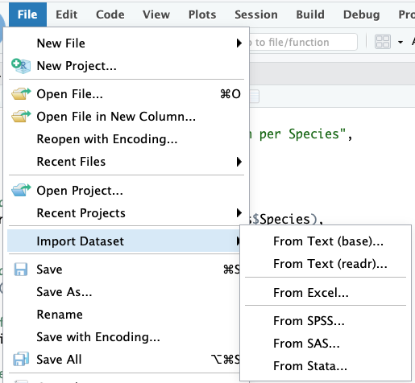

```{r xaringan-themer, include = FALSE}
options(blogdown.knit.serve_site = FALSE)
library(xaringanthemer)
mono_light(
  base_color = "midnightblue",
  header_font_google = google_font("Josefin Sans"),
  text_font_google   = google_font("Montserrat", "500", "500i"),
  code_font_google   = google_font("Droid Mono"),
  link_color = "#8B1A1A", #firebrick4, "deepskyblue1"
  text_font_size = "28px",
  code_font_size = "26px"
)
```

## Getting data in and out of R

.pull-left[
.center[]
]
.pull-right[

Native R Functions

```{r eval=FALSE}
read.csv()
write.csv()
```

- Read and write CSV files

```{r eval=FALSE}
read.table()
write.table()
```

- General-purpose functions for reading and writing data in table format, can handle different delimiters
]

???

Getting data in and out of R will be an indispensable part of data analysis. RStudio has a data import wizard supporting major statistical formats. R itself has several built-in functions to read and write delimited text data. read.csv() and write.csv() can read and write Comma-separated values (CSV) files. read.table() and write.table() are general-purpose functions for reading and writing data in table format, can handle different delimiters. Advantages of those functions are that they are simple and straightforward, and part of base R, no additional packages required. Disadvantages include their slower performance compared to other options. Less flexible in handling large datasets

---
## Getting data in and out of R

.pull-left[
.center[]
]
.pull-right[

`readr` package

```{r eval=FALSE}
readr::read_csv()
readr::write_csv()
```

- Read and write CSV files

```{r eval=FALSE}
readr::read_tsv()
readr::write_tsv()
```

- Read and write tab-separated files

]

???

The readr package provides faster functions for data reading and writing, compared to the base R equivalent. They can serve as a drop-in replacement of the base R functions. They better handle various data types (e.g., dates, factors), provide progress bars for large files. The minor disadvantage is that using these functions require installation of the reard package.

---
## Getting data in and out of R

.pull-left[
.center[]
]
.pull-right[

`data.table` package

```{r eval=FALSE}
data.table::fread()
data.table::fwrite()
```

]

???

The data.table package provides an extension of data frames called data tables, optimized for fast and efficient manipulation of large datasets. It offers enhanced performance compared to traditional data frames, especially for operations involving subsetting, grouping, and joining data. It's particularly useful for high-speed and memory efficient data handling with the fread and fwrite functions for data reading and writing in various formats. The minor disadvantage is that syntax may be less familiar to users of base R functions.

---
## Getting data in and out of R

.pull-left[
.center[]
]
.pull-right[

`readxl` and `writexl` packages

```{r eval=FALSE}
readxl::read_xlsx()
writexl::write_xlsx()
```

- Excel-Specific functions for reading and writing Excel files

]

???

A statistician Brian Ripley stated in his famous lecture quote: “Let's not kid ourselves: the most widely used piece of software for statistics is Excel.” Several packages for handling Excel files were developed, with readxl and writexl being the most useful. They do not depend on Java or external software and can handle multiple sheets.

---
## R datasets

R contains many datasets (stored as data frames) that are built-in to the software.

```{r}
data() # All built-in datasets
# ?trees
data(trees) # Load a particular one
head(trees)
```

???

Built-in datasets in R are pre-loaded datasets stored as data frames. These datasets cover a wide range of topics, including statistics, economics, biology, and social sciences, making them useful for learning, teaching, and research purposes. The data() function provides an overview of all built-in datasets and allow to load any in the R environment.

---
## Learn more

- Introduction to bioinformatics, https://uclouvain-cbio.github.io/WSBIM1207/sec-rrstudio.html

- Orientation to programming, R, and RStudio, https://gge-ucd.github.io/R-DAVIS/lesson_01_intro_r_rstudio.html

```{r echo=TRUE, eval=FALSE}
install.packages("swirl")
```
```{r echo=TRUE}
library(swirl)
```

???

Many free resources are available. We recommend to review the links on your screen and try the swirl R package. swirl is an interactive learning platform designed to teach R programming and data science concepts within the R environment. It provides a series of interactive lessons and quizzes that users can complete directly in the R console. The package covers various topics, from basic syntax and data structures to more advanced topics like data manipulation and visualization.

---
## Conclusion

.center[]

https://twitter.com/TanentzapfLab/status/1427720047431065601?s=20

???

The post from Tanentzapf Lab shares valuable career advice for scientists venturing into the biomedical sciences field. It emphasizes the importance of coding skills that we will learn in this course, and highlights the significance of biostatistics knowledge that you are getting in other courses. Let these words serve as an inspiration to better prepare you for successful careers in biomedical research.
