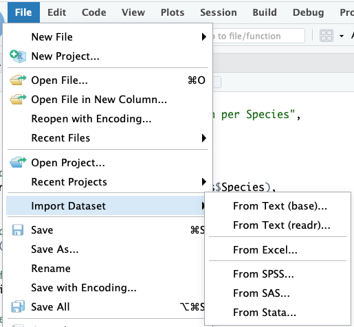
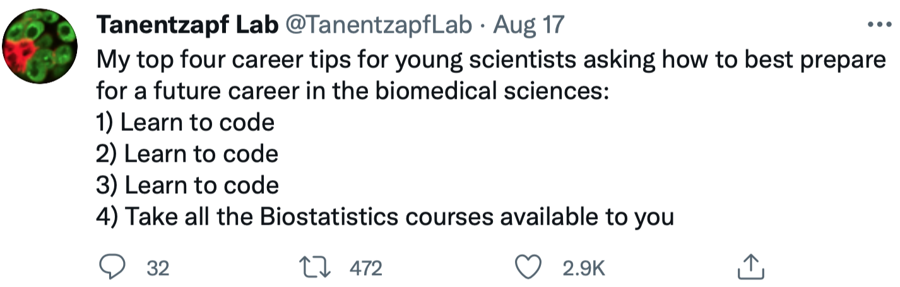

```{r xaringan-themer, include = FALSE}
options(blogdown.knit.serve_site = FALSE)
library(xaringanthemer)
mono_light(
  base_color = "midnightblue",
  header_font_google = google_font("Josefin Sans"),
  text_font_google   = google_font("Montserrat", "500", "500i"),
  code_font_google   = google_font("Droid Mono"),
  link_color = "#8B1A1A", #firebrick4, "deepskyblue1"
  text_font_size = "28px",
  code_font_size = "26px"
)
```

## Getting data in and out of R

.pull-left[
.center[]
]
.pull-right[

Native R Functions

```{r eval=FALSE}
read.csv()
write.csv()
```

- Read and write CSV files

```{r eval=FALSE}
read.table()
write.table()
```

- General-purpose functions for reading and writing data in table format, can handle different delimiters
]

???

Getting data in and out of R will be an indispensable part of data analysis. RStudio has a data import wizard supporting major statistical formats. R itself has several built-in functions to read and write delimited text data. read.csv() and write.csv() can read and write Comma-separated values (CSV) files. read.table() and write.table() are general-purpose functions for reading and writing data in table format, can handle different delimiters. Advantages of those functions are that they are simple and straightforward, and part of base R, no additional packages required. Disadvantages include their slower performance compared to other options. Less flexible in handling large datasets

---
## Getting data in and out of R

.pull-left[
.center[]
]
.pull-right[

`readr` package

```{r eval=FALSE}
readr::read_csv()
readr::write_csv()
```

- Read and write CSV files

```{r eval=FALSE}
readr::read_tsv()
readr::write_tsv()
```

- Read and write tab-separated files

]

???

The readr package provides faster functions for data reading and writing, compared to the base R equivalent. They can serve as a drop-in replacement of the base R functions. They better handle various data types (e.g., dates, factors), provide progress bars for large files. The minor disadvantage is that using these functions require installation of the reard package.

---
## Getting data in and out of R

.pull-left[
.center[]
]
.pull-right[

`data.table` package

```{r eval=FALSE}
data.table::fread()
data.table::fwrite()
```

]

???

The data.table package provides an extension of data frames called data tables, optimized for fast and efficient manipulation of large datasets. It offers enhanced performance compared to traditional data frames, especially for operations involving subsetting, grouping, and joining data. It's particularly useful for high-speed and memory efficient data handling. The fread and fwrite functions from this package can read and write data in various formats very fast. The minor disadvantage is that syntax may be less familiar to users of base R functions.

---
## Getting data in and out of R

.pull-left[
.center[]
]
.pull-right[

`readxl` and `writexl` packages

```{r eval=FALSE}
readxl::read_xlsx()
writexl::write_xlsx()
```

- Excel-Specific functions for reading and writing Excel files

]

???

Excel will be one of your main tools for handling data in tabular formats. Several packages for handling Excel files were developed, with readxl and writexl being the most useful. They do not depend on Java or external software and can handle multiple sheets.

---
## Save/load R objects

- `save()`, `load()` - saves/loads R **objects** to the specified file
``` r
x <- stats::runif(20)
y <- list(a = 1, b = TRUE, c = "oops")
save(x, y, file = "xy.rda")
load(file = "xy.rda")
```

- `saveRDS()`, `readRDS()` - saves/loads a __representation__ of the object
``` r
x <- stats::runif(20)
saveRDS(x, file = "x.rds")
x2 <- readRDS(file = "x.rds")
identical(x, x2, ignore.environment = TRUE)
```

.small[ https://fromthebottomoftheheap.net/2012/04/01/saving-and-loading-r-objects/ ]

???

Another way of saving data is to save R objects in the native binary format. This is achieved with the save and load functions. These functions are useful if you want to save multiple objects in one file and restore them exactly as they were before. On the other hand, the saveRDS and loadRDS functions save a representation, or the content, of an object. They may be useful when you want to save the data stored in an object and not concerned about object names.

---
## R datasets

R contains many datasets (stored as data frames) that are built-in to the software.

```{r}
data() # All built-in datasets
# ?trees
data(trees) # Load a particular one
head(trees)
```

???

R has several built-in datasets that cover a wide range of topics, including statistics, economics, biology, and social sciences. They are  useful for learning, teaching, and research. The data() function provides an overview of all built-in datasets and allow to load any dataset in the R environment.

---
## Learn more

- Introduction to bioinformatics, https://uclouvain-cbio.github.io/WSBIM1207/sec-rrstudio.html

- Orientation to programming, R, and RStudio, https://gge-ucd.github.io/R-DAVIS/lesson_01_intro_r_rstudio.html

```{r echo=TRUE, eval=FALSE}
install.packages("swirl")
```
```{r echo=TRUE}
library(swirl)
```

???

Many free resources to learn R are available. We recommend to review the links on your screen and try the swirl R package. swirl is an interactive learning platform designed to teach R programming and data science concepts within the R environment. It provides a series of interactive lessons and quizzes that users can complete directly in the R console. The package covers various topics, from basic syntax and data structures to more advanced topics like data manipulation and visualization. Good luck on your R journey!

<!--
## Conclusion

.center[]

https://twitter.com/TanentzapfLab/status/1427720047431065601?s=20

???

The post from Tanentzapf Lab shares valuable career advice for scientists venturing into the biomedical sciences field. It emphasizes the importance of coding skills that we will learn in this course, and highlights the significance of biostatistics knowledge that you are getting in other courses. Let these words serve as an inspiration to better prepare you for successful careers in biomedical research.
-->