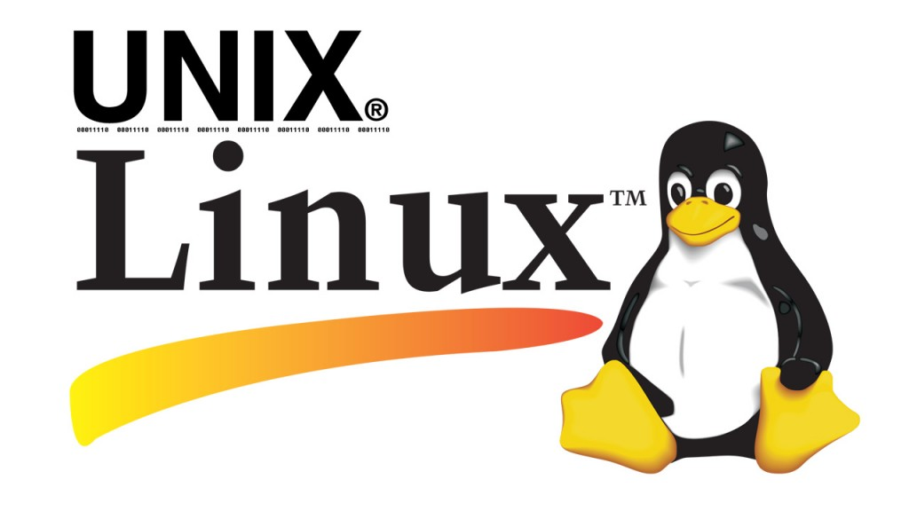
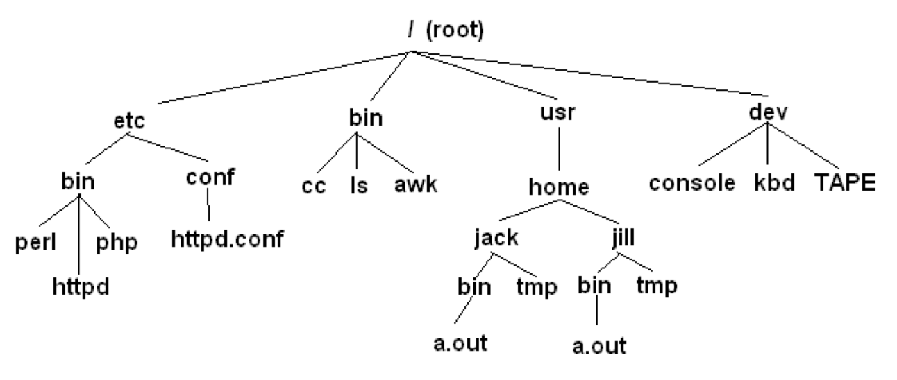

```{r xaringan-themer, include = FALSE}
library(xaringanthemer)
mono_light(
  base_color = "midnightblue",
  header_font_google = google_font("Josefin Sans"),
  text_font_google   = google_font("Montserrat", "500", "500i"),
  code_font_google   = google_font("Droid Mono"),
  link_color = "#8B1A1A", #firebrick4, "deepskyblue1"
  text_font_size = "28px",
  code_font_size = "26px"
)
```

## R and Unix

- R does not exist in isolation - it interacts with the operating system

- Many data science tasks are done in Unix command line, before or after data is processed in R

- Programming logic is applicable in R and Unix command line, some commands are named similarly (e.g., grep)

---
## What is Unix

- Unix is a family of operating systems and environments that exploits the power of linguistic abstractions to perform tasks
- Unix is not an acronym; it is a pun on "Multics". Multics was a large multi-user operating system that was being developed at Bell Labs shortly before Unix was created in the early '70s. Brian Kernighan is credited with the name
- Most big data analyses and deep learning are done in Unix

<center></center>

.small[ http://www.read.seas.harvard.edu/~kohler/class/aosref/ritchie84evolution.pdf


---
## History of Unix

- Initial file system, command interpreter (shell), and process management started by Ken Thompson
- File system and further development from Dennis Ritchie, as well as Doug McIlroy and Joe Ossanna
- Vast array of simple, dependable tools that each do one simple task

<center></center>

.small[ Ken Thompson (sitting) and Dennis Ritchie working together at a PDP-11 ]

---
## Philosophy of Unix

- Vast array of simple, dependable tools

- Each do one simple task, and do it really well

- By combining these tools, one can conduct rather sophisticated analyses

- The Linux help philosophy: "RTFM" (Read the Fine Manual)

<!---
## Know your Unix

- Unix users spend a lot of time at the **command line**

- In Unix, a word is worth a thousand mouse clicks

<center></center>
-->

---
## Unix systems

- Three common types of laptop/desktop operating systems: Windows, Mac, Linux
- Mac and Linux are both Unix-like
- What that means for us: Unix-like operating systems are equipped with "shells"" that provide a command line user interface

<center></center>

---
## Shell, aka command line, aka terminal

- Shell is an interactive environment with a set of commands to initiate and direct computations

- Shell encloses the complexity of OS, hence the name  
    - You type in commands 
    - Shell executes them

- In Unix, a command is worth a thousand mouse clicks

https://en.wikipedia.org/wiki/Unix_shell 

---
## Shell, aka command line, aka terminal

- The shell (`sh`) is a command-line interpreter for computer operating systems

- Developed by Stephen Bourne at Bell Labs, 1976

- `bash` (the Bourne-Again shell) was later developed for the GNU project and incorporates features from the original shell and other shells. It is meant to be POSIX-compliant

- `zsh` (the Z shell) is an extended Bourne shell with many improvements, including some features of Bash, ksh, and tcsh. Zsh was created by Paul Falstad in 1990

https://en.wikipedia.org/wiki/Stephen_R._Bourne 

<!--
## Most popular types of shell

- `bash` - Bourne-Again shell

- `tcsh` - TENEX C shell

- `zsh` - Z shell

- Change shell: `chsh –s /bin/zsh`

- `$SHELL` environmental variable has path to the currently used shell

## Getting to the command line

- Remote access, SSH, **PuTTY** (http://www.chiark.greenend.org.uk/~sgtatham/putty/), **MobaXterm** (https://mobaxterm.mobatek.net/)

- **Mac OS X + Xcode development suite** (free, https://developer.apple.com/xcode/) + **X11 server** (free, https://www.xquartz.org/) + **iTerm2** (optional, https://iterm2.com/)

- **Ubuntu Linux** (long-term support LTS version, XX.04, http://www.ubuntu.com/download/desktop)

## Getting to the command line | Windows users   

- **Windows Subsystem for Linux**, https://github.com/sirredbeard/Awesome-WSL

- **Cygwin**, http://www.cygwin.com/

- **Git Bash**, https://git-for-windows.github.io/ 

- Boot from a CD or USB (search for "linux usb")

- Install the whole Linux systems as a Virtual Machine in **VirtualBox**, https://www.virtualbox.org/

## Getting to the command line | Mac users  

- "Terminal" is already installed, `bash` shell

- Why? Darwin, the system on which Apple's Mac OS X is built, is a derivative of 4.4 BSD-Lite2 and FreeBSD. In other words, the Mac is a Unix system

- For X11 (graphics), see XQuartz, http://xquartz.macosforge.org/landing/

- `iTerm2` - a better terminal replacement for Mac, https://www.iterm2.com/

## Obtaining new command-line software

- Modern Unix systems have package managers to that download install (free) software for you

- On a Mac, **Homebrew** (http://brew.sh/) is a popular package-management system (alternatively, **MacPorts**, https://www.macports.org/)

- On Ubuntu, **apt** (https://itsfoss.com/apt-get-linux-guide/) is the standard package manager, with both a command-line and graphical interface available

- On Windows, **Cygwin** (https://cygwin.com/install.html) installs everything precompiled through its setup file. Do not delete `setup-x86_64.exe` file after installing Cygwin, explore what Linux tools are available (a lot)
-->

---
## Interacting with shell

- Most commands take additional arguments that fine tune their behavior

- If you don't know what a command does, use the command `man <command>`

- Press `q` to quit the `man` page viewer

- Most often, you’ll use `<command> -h` or `<command> --help`

- Some commands output help if executed without any arguments

---
## File paths: change directory (`cd`)

<center></center>

- `cd /` - go to the root directory
- `cd /usr/home/jack/bin` - go to the user’s sub-directory
- `cd ..` - go to the upper level directory
- `cd`, or `cd ~` - go to the user’s home directory
- `cd --` - go to the last visited directory

---
## Orienting in the filesystem: print working directory (`pwd`)

```{bash}
pwd
```


- `ls` 			- list all files in the current directory
```{bash}
ls
```

<!--
- `ls -1` 	- list files in _one_ column

- `ls –lah`	- list files in `l`ong, `h`uman readable format, include `a`ll content, user, owner, permissions
-->

---
## Creating, moving, copying, and removing files

- `touch <file>` - creates an empty file

- `nano <file>` - edit it

- `mkdir <dirname>` - creates a directory

- `cp <source_file> <target_file>` - copy a file to another location/file

- `mv <source_file> <target_file>` - move a file

- `rm <file>` - remove a file. If multiple files provided, removes all of them

- `rm –r <dirname>` - recursive removal (deletes a directory)

---
## Permissions: `chmod`, `chown` and `chgrp`

In Unix, every file and directory has an **owner** and a **group**  

- `Owner` - is the one who created a file/directory


- `Group` - defines rules of file operations and/or permissions

<!-- - `Every` - user on a Unix machine can belong to one or more groups -->

Every file has **three permission levels**   

- what the **u**ser can do
- what the **g**roup can do
- what the **a**ll (everyone) can do

---
## Understanding ls -lah output

- The first symbol indicates a regular file ("-") or a directory ("d")
- The first three positions (after the "-" or "d") designate owner's permissions
- The second three positions designate permissions for the group
- The last three positions are for the world/anyone
- The number before the user name indicates the levels of directories
- Username/groupname indicate the owner/group of the file


```{bash}
ls -lah
```

<!--
## Understanding ls -lah output

- The first column tells you about permissions
    - The very first character in the permissions column tells you what kind of file it is. A **-** means it's a regular file. A **d** means it's a directory
    - The next nine characters come in three classes, each has three characters. The three classes are `owner`/`group`/`world` permissions
    - Inside a permission class, **r** means that class can **r**ead the file; **w** means that class can **w**rite the file; **x** means that class can e**x**ecute the file

- The second column has the number of files (inside a directory)
- The third and fourth columns tell you the owner and group
-->

---
## Finding your files

- `find` - lists all files under the working directory (and its subdirectories) based on arbitrary criteria

- `find .` - prints the name of every file or directory, recursively. Starts from the current directory

- `find . –type f` - finds files only

- `find . –type d –maxdepth 1` - finds directories only, at most 1 level down

- `find . –type f –name "*.mp3"` - finds only *.mp3 files

- `find . -type f -name "README.md" -exec wc -l {} \;` - find files and execute a command on them

---
## Wildcards and patterns

Regular expression metacharacters are used in command line

- `*` - matches any character

- `?` - matches a single character

- `[chars]` - matches any character in chars

- `[a-zA-Z]` - matches any character between `a` and `z`, including capital letters

- `ls *.md`

- `ls [Rt]*`

---
## Looking inside files

- `cat <file>` - prints out content of a file. If multiple files, consequently prints out all of them (concatenates)
  - `head/tail <file>` - prints first/last 10 lines

<!-- - `zcat` - prints out content of gzipped files -->

- `less <file>` - shows the content of the file one screen at a time

**Keyboard shortcuts for `less` command**  

- `space` - forward, `b` - backward
- `g` - go to the beginning, `G` - go to the end
- `/<text>` - starts forward search, enter to find next instance
- `q` - quit

---
## Chaining commands: pipes

- One of the most useful capabilities of Unix is the ability to redirect the STDOUT of one command into the STDIN of another

- The `|` (pipe) character feeds output from the first program (to the left of the `|`) as input to the second program on the right. Therefore, you can string all sorts of commands together using the pipe

```
find . -type f -name "*.mp3" | wc -l
cat names.txt | sort | uniq -c
```

- Executing one command AFTER another completed successfully: `<command> && <command>`

```
mkdir music && mv *.mp3 music/
```

<!--
## Chaining commands: redirections

- Nearly every command in Unix makes use of a convention to have a "standard input" (also called stdin or STDIN, or channel 0) and "standard output" (also called stdout or STDOUT, or channel 1)

- There is also a "standard error" (stderr or STDERR, or channel 2) output that is, by convention, reserved for error messages

- `find / 2> error.log` - capture STDERR into a file
- `find / 2> /dev/null` - suppress STDERR messages
- `find / 2>&1` - add STDERR to STDOUT

## Chaining commands: redirections

- If you want to dump the standard output into a file, use `command > file` (overwrites the file). `command >> file` (appends to the file)

- Redirection example: `ls > README.md` - save file list in the current directory into README.md file

- Redirection works in another direction: `grep CC0 < License.md`

- Or, the content of a commant into another command: `join <(sort file1) <(sort file2)`
-->

---
## Other essential commands

|           |          |
|-----------|----------|
| head/tail | cut      |
| for       | comm     |
| sort      | echo     |
| uniq      | basename |
| wc        | dirname  |
| tr        | history  |
| grep      | which    |
| join      | who      |
| kill      | grep     |
| tar       | seq      |
| gzip      | paste    |

<!--
## Statistical command line goodies

**data_hacks**, https://github.com/bitly/data_hacks

- Command line tools for data analysis
- `histogram.py`
- `bar_chart.py`
- `sample.py`

**datamash**, https://www.gnu.org/software/datamash/

- summary statistics
- transposing matrixes


## Learn more 

- https://www.tutorialspoint.com/unix/index.htm

- Heng Li's "A Bioinformatician's UNIX Toolbox", http://lh3lh3.users.sourceforge.net/biounix.shtml

- Bioinformatics one-liners by Stephen Turner, https://github.com/stephenturner/oneliners

- Collection of bioinformatics-genomics bash one liners, using awk, sed etc. https://github.com/crazyhottommy/bioinformatics-one-liners

- Links and references to many genomics and bioinformatics resources, https://github.com/crazyhottommy/getting-started-with-genomics-tools-and-resources
-->
