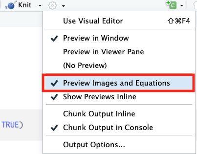

```{r xaringan-themer, include = FALSE}
library(xaringanthemer)
mono_light(
  base_color = "midnightblue",
  header_font_google = google_font("Josefin Sans"),
  text_font_google   = google_font("Montserrat", "500", "500i"),
  code_font_google   = google_font("Droid Mono"),
  link_color = "#8B1A1A", #firebrick4, "deepskyblue1"
  text_font_size = "28px",
  code_font_size = "24px"
)
```

```{r, echo=FALSE}
catn <- function(x="") cat("    ", x, "\n")
```


## Inline math MathJax

- MathJax is a JavaScript library that displays mathematical notation using LaTeX, MathML, and AsciiMath markup

- Inline equations - use single "dollar sign" `$` to specify MathJax coding

 
``` text
$s^{2} = \frac{\sum(x-\bar{x})^2}{n-1}$
```

$s^{2} = \frac{\sum(x-\bar{x})^2}{n-1}$

.small[ Check out this online tutorial, it has everything about MathJax  http://meta.math.stackexchange.com/questions/5020/mathjax-basic-tutorial-and-quick-reference ]
 
---
## Display math MathJax

Insertion of two dollar signs `$$` places your equation on a separate line and centers it:
 
``` text
  $ \sum_{i=0}^n i^2 = \frac{(n^2+n)(2n+1)}{6} $
  
  $$ \sum_{i=0}^n i^2 = \frac{(n^2+n)(2n+1)}{6} $$
```

Inline equation  $\sum_{i=0}^n i^2 = \frac{(n^2+n)(2n+1)}{6}$ on the same line. Or, self-standing equation on a separate line $$\sum_{i=0}^n i^2 = \frac{(n^2+n)(2n+1)}{6}$$
  
---
## More useful codes

**Greek Letters**
  
``` text
 $\alpha$      $\beta$       $\gamma$      $\chi$
 $\Delta$      $\Sigma$      $\Omega$
```

**Greek Letters:  (not all capitalized Greek letters available)**
  
$\alpha$      $\beta$       $\gamma$      $\chi$
 
$\Delta$      $\Sigma$      $\Omega$
  
**superscripts `(^)` and subscripts `(_)`**
  
- Writing `x^2_i` renders as $x_i^2$
- Writing `log_2 x` renders as $log_2 x$

---
## Grouping with brackets

Use brackets {...} to delimit a set of characters containing a superscript or subscript.  Notice the difference the grouping makes:

- Writing `${x^y}^z$` renders as ${x^y}^z$

- Writing `$x^{y^z}$`  renders as $x^{y^z}$

- Writing `$x_{ij}^2$` renders as $x_{ij}^2$

- Writing `$x_{i^2}$` renders as $x_{i^2}$

---
## Scaling

Add the scaling code `\left(` ... `\right)` to make automatic size adjustments

- Writing `$(\frac{\sqrt x}{y^3})$` renders as $(\frac{\sqrt x}{y^3})$

- Writing `$\left(\frac{\sqrt x}{y^3}\right)$` renders as $\left(\frac{\sqrt x}{y^3}\right)$


---
## Sums and Integrals

Subscript (_) designates the lower limit; superscript (^) designates upper limit:
 
- Writing `$\sum_1^n$` renders to $\sum_1^n$

- Writing `$\sum_{i=0}^\infty i^2$` renders to $\sum_{i=0}^\infty i^2$

Other notable symbols:
 
``` text
$\prod$           $\infty$ 
$\bigcup$         $\bigcap$
$\int$            $\iint$
``` 

$\prod$              $\infty$
$\bigcup$            $\bigcap$
$\int$               $\iint$


---
## Radical Signs

Use 'sqrt' code to show the square root of its argument. Note the use of `{}` to group arguments. Note the change in size of the square root function based on the code

- Writing `$\sqrt{x^3}$` renders to $\sqrt{x^3}$

- Writing `$\sqrt{3}{\frac xy}$` renders to $\sqrt{3}{\frac xy}$


---
## You can also change fonts!

``` text
$\mathbb or $Bbb for 'Blackboard bold"
$\mathbf for boldface  
$\mathtt for 'typewritter' font
$\mathrm for roman font
$\mathsf for sans-serif
$\mathcal for 'caligraphy' 
$\mathscr for script letter: 
$\mathfrak for "Fraktur" (old German style)
```

$\mathbb {ABCDEFG}$   $\mathbf {ABCDEFG}$   $\mathtt {ABCDEFG}$   $\mathrm {ABCDEFG}$   $\mathsf {ABCDEFG}$   $\mathcal {ABCDEFG}$   

---
## You can also change fonts!

Some special functions such as "lim" "sin" "max" and "ln" are normally set in roman font instead of italic.  Use `\lim`,  `\sin` to make these (roman):

``` text
$\sin x$   (roman)  vs.  $sin x$  (italics)
```
$\sin x$   (roman)  vs. $sin x$    (italics) 

---
## And, add curly brackets

``` text
$$\begin{cases}
\widehat{IF_{1D}} = IF_{1D} - f(D)/2 \\
\widehat{IF_{2D}} = IF_{2D} + f(D)/2
\end{cases} \ (1)$$
```

$$\begin{cases}
\widehat{IF_{1D}} = IF_{1D} - f(D)/2 \\
\widehat{IF_{2D}} = IF_{2D} + f(D)/2
\end{cases} \ (1)$$

---
## RStudio bonus

Inline preview of forumlas and images in an RMarkdown document

.center[]

.small[ Preview online https://www.codecogs.com/latex/eqneditor.php]
