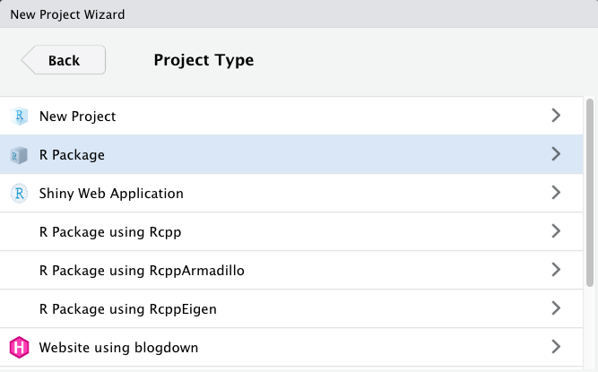

```{r xaringan-themer, include = FALSE}
library(xaringanthemer)
mono_light(
  base_color = "midnightblue",
  header_font_google = google_font("Josefin Sans"),
  text_font_google   = google_font("Montserrat", "500", "500i"),
  code_font_google   = google_font("Droid Mono"),
  link_color = "#8B1A1A", #firebrick4, "deepskyblue1"
  text_font_size = "28px",
  code_font_size = "26px"
)
```

```{r setup, include=FALSE}
knitr::opts_chunk$set(echo = TRUE,
                      size = "footnotesize",
                      error=TRUE,
                      fig.align="center")
library(ggplot2)
library(tidyverse)
library(magrittr)
library(gapminder)
```

## Do One Thing and Do It Well

- Functions are minimal bits of **repeated code** that do one thing well

- Should be universal – applied to a variety of problems

- Scalability – should handle small and large tasks equally well

``` r
fahrenheit_to_celsius <- function(temp_F) {
  temp_C <- (temp_F - 32) * 5 / 9
  return(temp_C)
}
```

---
## Writing your functions	

- Each function better be in a separate file, e.g., `temperature.R`

- Should contain code and documentation

- In a package, functions are placed in the `R` subfolder

``` r
fahrenheit_to_celsius <- function(temp_F) {
  temp_C <- (temp_F - 32) * 5 / 9
  return(temp_C)
}
```

---
## Functions

Functions are created using the `function()` directive

``` r
f <- function(<arguments>) {
# Do something interesting
# Return the result 
}
```

The return value of a function is the last expression in the function body to be evaluated

---
## Arguments

- Functions have named arguments

- Arguments may have default values, be required, optional, or missing

- Arguments can be set by name, the order is not important
``` r
sd(x = mtx, na.rm = TRUE) # Equivalent to sd(na.rm = TRUE, x = mtx)
```

- Arguments can be matched positionally
``` r
sd(mtx, TRUE) # But changing order won't work. sd(TRUE, mtx) - wrong
```

- Always use the default order. Using names is recommended for clarity. Mix and match OK

---
## Message throughout the function

- `message("message")` will output “message” upon running unless `suppressMessages` is set to TRUE

- `warning("warning")` will output a warning with the message “warning” upon running unless `suppressWarnings` is set to TRUE

- `stop("error")` will terminate execution of a function and provide the message “error” upon exit. If the function is part of a larger script, will terminate running the entire script

---
## Recursive function: factorial

```{r}
# fact1 calculates the factorial of a number x using a recursive approach
fact1 <- function(x) {
    if (x == 1) return(1) else return(x * fact1(x - 1)) 
}

# fact2 calculates the factorial of a number x using a vectorized approach
fact2 <- function(x) {
    prod(1:x)
}

# fact3 calculates the factorial of a number x using the gamma function
fact3 <- function(x) {
    gamma(x + 1)
}
```

---
## Recursive function: factorial

```{r}
system.time(for (i in 1:1e4) fact1(100))
system.time(for (i in 1:1e4) fact2(100))
system.time(for (i in 1:1e4) fact3(100))
```

---
## Recursive function: Fibonacci numbers

```{r}
# fibR calculates the nth Fibonacci number using a recursive approach.
# The function calls itself with n-1 and n-2 until the base cases of 
# n == 0 or n == 1 are reached. While simple and elegant, this method 
# can be highly inefficient for large values of n due to redundant 
# calculations, resulting in exponential time complexity.
fibR <- function(n) {
    if (n == 0) return(0)
    if (n == 1) return(1)
    return (fibR(n - 1) + fibR(n - 2))
}

```

```{r eval=FALSE, echo=FALSE}
fibonacci <- local({  #local evaluates an expression in a local environment
 memo <- c(1, 1, rep(NA, 100))
 
 f <- function(x) {
  if(x == 0) return(0)
  if(x < 0) return(NA)
  if(x > length(memo)) stop("`x' too big for implementation")
  if(!is.na(memo[x])) return(memo[x])
  ans <- f(x-2) + f(x-1)
  memo[x] <<- ans
  ans 
  }
})

fibonacci2 <- function(n) {
 if (n == 0) return(0)
 if (n == 1) return(1)
 if (n == 2) return(1)
 x=vector("integer",n)
 x[1:2] <- 1
 for (i in 3:n) x[i]=x[i-1]+x[i-2]
 x[n]
}
```

---
## Making Functions Available in the R Environment

- Copy-paste your function's code in the console

- If you saved your function in a file, source it with `source("path/to/my_functions.R")`
  - If you open this file in RStudio, you can click the "Source" button

- Functions from other packages are made available by loading a package with `library(package_name)`

---
class: inverse, center, middle

# Packages

---
## DRY, don't repeat yourself

- If you're repeating the same lines of code in multiple places, you should turn those minimal repetitive tasks into functions – reuse your code

- A package is a collection of frequently used functions

- Package = easiest way to distribute code and data

- Package = easiest way to reuse other’s code

---
## Starting an R package using RStudio

Ideally, create packages from scratch as soon as you begin on a project

- RStudio -> File -> New project -> New Directory -> R Package

.center[]

---
## Package made simple with usethis

`usethis` is a workflow package: it automates repetitive tasks that arise during project setup and development, both for R packages and non-package projects

``` r
library(usethis)

# Create a new package
path <- file.path(tempdir(), "mypkg")
create_package(path)
```

- Most functions start with `use_*()` (e.g., `use_vignette()`, `use_mit_license()`)
- `usethis::create_package()` will create package's skeleton and the DESCRIPTION file


.small[https://usethis.r-lib.org/]

---
## `DESCRIPTION` - package's metadata

- **Package** - Name of the package
- **Type** - Type of package, usually "Package"
- **Title** - A short title for the package
- **Version** - Current version of the package
- **Author** - Author(s) of the package, including roles (aut, cre, ctb)
- **Maintainer** - Person responsible for package maintenance
- **Description** - A brief description of what the package does
- **License** - The license under which the package is distributed
- **Depends** - Specifies the R version and other packages
- **Imports** - Lists additional packages that are imported
- **Suggests** - Packages that are suggested but not required
- **Enhances** - Packages that are enhanced by this package
- **Encoding** - Character encoding used in the package
- **LazyData** - Indicates whether lazy-loading of data is used
- **RoxygenNote** - Version of roxygen2 used to generate the documentation

---
# Example of a DESCRIPTION File

```
Package: MyPackage
Type: Package
Title: A Brief Description of MyPackage
Version: 1.0.0
Author: John Doe [aut, cre], Jane Smith [ctb]
Maintainer: John Doe <johndoe@example.com>
Description: This package provides tools for XYZ analysis.
License: GPL-3
Depends: R (>= 3.5.0)
Imports: dplyr, ggplot2
Suggests: testthat, knitr
Enhances: Rcpp
Encoding: UTF-8
LazyData: true
RoxygenNote: 7.1.1
```

---
## Starting an R package: `DESCRIPTION`

Edit the `DESCRIPTION` file

- Adjust _Title_, _Author_ and _role_, _Description_ (as verbose as you can)

- Add license (`usethis::use_mit_license()` and similar functions)

.small[http://r-pkgs.had.co.nz/description.html]

---
## Starting an R package: `DESCRIPTION`

- If some of your functions use functions from other packages, you should add `imports` (forced install) and/or `suggests` (suggested install) sections to the `DESCRIPTION` file

``` r
usethis::use_package("dplyr") # Adding dplyr to Imports
usethis::use_package("dplyr", type = "Suggests") # Adding dplyr to Suggests
```

- Functions from packages declared in the `DESCRIPTION` file should be used with the `::` sign, e.g., `dplyr::left_join()`

.small[http://r-pkgs.had.co.nz/description.html]

<!--
## Starting an R package: `DESCRIPTION`

Short-term: Keeps track of imports (dependencies)

Long-term: Help others find your package

``` r
Package: examplepackage
Type: Package
Title: What the Package Does (Title Case)
Version: 0.1.0
Authors@R: person("First", "Last", email = "first.last@example.com",
                  role = c("aut", "cre"))
Description: More about what it does (maybe more than one line)
    Use four spaces when indenting paragraphs within the Description.
Depends: R (>= 4.0.0)
License: What license is it under?
Encoding: UTF-8
LazyData: true
```
-->

---
## Writing your first function

Create a file `cat_function.R` with the following content

``` r
cat_function <- function(love.cats = TRUE){
  if(love.cats == TRUE){
    print("I love cats!")
  }
  else {
    print("I will love cats!")
  }
}
```

cat_function is defined with one argument love.cats which defaults to TRUE
